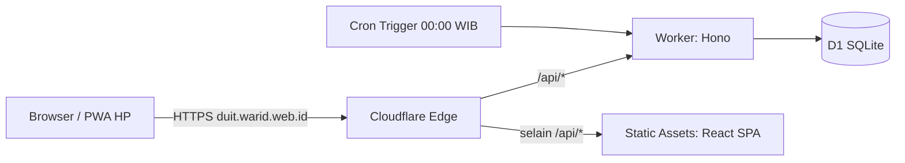
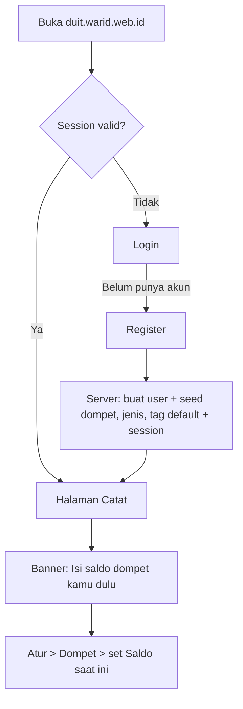
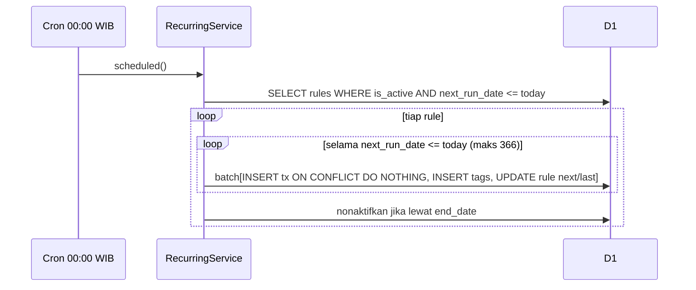

# duit — Akuntansi Keuangan Pribadi (Web)

> **Domain:** `duit.warid.web.id` · **Deploy:** Cloudflare Workers (single Worker + Static Assets + D1) · **CI/CD:** GitHub Actions · **Branch:** `main` saja

---

## 0. Cara Pakai Dokumen Ini (untuk AI Agent)

Dokumen ini adalah **spesifikasi tunggal** (one-shot). Kerjakan sampai selesai tanpa bertanya balik.

1. Baca seluruh dokumen dulu sebelum menulis kode.
2. Semua keputusan teknis sudah **dikunci** di bagian 2. Jangan ganti stack.
3. Kerjakan sesuai urutan di bagian 17 (Build Order). Setiap fase harus lolos `pnpm lint && pnpm typecheck && pnpm test && pnpm build` sebelum lanjut.
4. Bagian yang **tidak bisa dikerjakan agent** (token, secret, DNS, dsb.) ada di bagian 3. Jangan mengarang nilainya. Buat placeholder + `.dev.vars.example` + jelaskan di `README.md`.
5. Versi library: pakai **versi stable terbaru saat scaffolding**, lalu pin exact di `package.json` dan commit lockfile. Pastikan kompatibel satu sama lain (khususnya `vitest` ↔ `@cloudflare/vitest-pool-workers`, `vite` ↔ `@cloudflare/vite-plugin`).
6. Bahasa: **UI copy = Bahasa Indonesia** (santai-sopan, sapaan "kamu"). **Kode, identifier, komentar, commit = English.**
7. Jika ada ambiguitas: pilih opsi paling sederhana yang memenuhi acceptance criteria, lalu catat asumsinya di `README.md` bagian "Assumptions".

---

## 1. Produk

### 1.1 Problem
Pemilik boncos karena **tidak tahu uangnya keluar ke mana**.

### 1.2 Solusi
Aplikasi web pribadi yang membuat **mencatat pengeluaran secepat mungkin (≤ 3 tap)** dan menampilkan **laporan yang langsung menjawab "duit gua lari ke mana?"**.

### 1.3 Prinsip Desain
- **Simpel di atas segalanya.** Tidak ada COA, tidak ada double-entry, tidak ada istilah akuntansi rumit.
- **Catat dulu, rapikan nanti.** Halaman pertama setelah login = form catat.
- **Auto login.** Session cookie berumur panjang (90 hari, sliding). Buka app → langsung form catat.
- **Mobile first.** Dipakai satu tangan di HP. Desktop hanya "HP yang melebar".
- **Setiap user hanya melihat datanya sendiri.** Tidak ada admin, tidak ada sharing.
- **Kesadaran > kelengkapan.** Tampilkan total hari ini/bulan ini saat mencatat, peringatan budget, dan insight sederhana.

### 1.4 Fitur Inti (wajib)
1. **Login / Register** (email + password). Tanpa admin. Data terisolasi per user.
2. **Pengaturan Keuangan:** Tag/Label, Jenis (kategori), Dompet/Kantong (dengan setting saldo saat ini).
3. **Laporan keuangan** (bulanan, per jenis, per tag, tren, saldo dompet).

### 1.5 Fitur Tambahan (sudah disetujui)
4. **Budget per Jenis** (batas bulanan per jenis pengeluaran + progress + peringatan).
5. **Transaksi Berulang** (recurring: harian/mingguan/bulanan/tahunan, otomatis lewat Cron Trigger).
6. **Export CSV** transaksi.
7. **Transfer antar dompet** (bukan pemasukan/pengeluaran).

### 1.6 Tambahan dari Spec Ini (ringan, sudah termasuk)
- PWA manifest (bisa "Add to Home Screen", tampil fullscreen). **Tanpa** service worker/offline.
- Toggle `REGISTRATION_ENABLED` supaya pendaftaran bisa ditutup setelah akun pemilik dibuat.
- Undo 5 detik setelah menyimpan transaksi.
- Insight sederhana: rata-rata harian, proyeksi akhir bulan, perbandingan bulan lalu, top jenis pengeluaran.
- Tag default "Kebutuhan / Keinginan / Impulsif / Langganan" untuk membedah pemborosan.
- Rate limit login + ganti password + logout semua perangkat.
- Script reset password manual (karena tidak ada fitur lupa password / kirim email).

### 1.7 Non-Goals (JANGAN dibuat)
COA / kode akun, double-entry, multi-currency (IDR saja), admin panel, sharing antar user, verifikasi email, lupa password via email, sinkronisasi bank, OCR struk, mode offline, notifikasi push, dark mode, drag-and-drop reorder, hapus akun, i18n.

### 1.8 Istilah
| Istilah UI | Arti teknis |
|---|---|
| **Dompet / Kantong** | `wallet` — tempat uang (Tunai, Bank, E-Wallet). |
| **Jenis** | `category` — kategori transaksi (Makan, Transport, Gaji, ...). Punya `kind`: `income` atau `expense`. |
| **Tag** | `tag` — label bebas, many-to-many dengan transaksi. |
| **Keluar / Masuk / Pindah** | `expense` / `income` / `transfer`. |

---

## 2. Tech Stack (DIKUNCI)

Pilihan: stack yang paling umum dan paling dipahami AI agent untuk Cloudflare.

| Layer | Pilihan |
|---|---|
| Runtime / Hosting | **Cloudflare Workers** dengan **Static Assets** (satu Worker melayani SPA + API). Bukan Pages. |
| Backend | **Hono** (TypeScript) |
| Database | **Cloudflare D1** (SQLite) |
| ORM / Migration | **Drizzle ORM** + **drizzle-kit** (generate SQL) → dijalankan `wrangler d1 migrations apply` |
| Validasi | **Zod** (schema di `src/shared`, dipakai client & server) + `@hono/zod-validator` |
| Frontend | **React 19** + **Vite** + **TypeScript** (SPA) |
| Build integration | **`@cloudflare/vite-plugin`** |
| Routing FE | `react-router` (declarative mode) |
| Server state FE | **TanStack Query** |
| Form | `react-hook-form` + `@hookform/resolvers` (zod) |
| Styling | **Tailwind CSS v4** (design tokens via `@theme`) |
| UI primitives | `@radix-ui/react-dialog` (bottom sheet/modal). Komponen lain buat sendiri. |
| Icons | `lucide-react` |
| Font | `@fontsource-variable/fraunces` (heading), `@fontsource-variable/dm-sans` (body). Self-host, tanpa request eksternal. |
| Chart | **Tanpa library chart.** Bar/donut sederhana dengan CSS/SVG buatan sendiri. |
| Test | **Vitest** (+ `@cloudflare/vitest-pool-workers` untuk test yang butuh D1) + Testing Library untuk komponen kritis |
| Lint/Format | ESLint (flat config, `typescript-eslint`, `react-hooks`) + Prettier |
| Package manager | **pnpm** (set `packageManager` di `package.json`) |
| Node | 22 LTS (`.nvmrc`) |
| CI/CD | **GitHub Actions** |

Hashing password: **PBKDF2-SHA256 via WebCrypto** + pepper (lihat bagian 8). Jangan pakai bcrypt/argon2 native.

---

## 3. CHECKLIST MANUAL — Yang TIDAK Bisa Dikerjakan AI Agent

> Bagian ini untuk **pemilik project**. Agent: jangan mengisi nilai asli; cukup siapkan placeholder dan dokumentasi di README.

### 3.1 Prasyarat akun & domain
- [ ] Akun Cloudflare aktif.
- [ ] Zone **`warid.web.id`** sudah **Active** di Cloudflare (nameserver domain sudah diarahkan ke Cloudflare). Custom domain Worker hanya bisa dipasang kalau zone-nya ada di akun yang sama.
- [ ] Repo GitHub dibuat, branch `main`.

### 3.2 Buat resource Cloudflare (sekali saja, dari laptop)
```bash
pnpm wrangler login
pnpm wrangler d1 create duit-db
# Salin `database_id` dari output → tempel ke wrangler.jsonc (database_id bukan secret, boleh di-commit)
```

### 3.3 Buat Cloudflare API Token
Dashboard → **My Profile → API Tokens → Create Token** (Custom token / mulai dari template "Edit Cloudflare Workers").

Permission minimum:
| Scope | Permission | Akses |
|---|---|---|
| Account | Workers Scripts | Edit |
| Account | D1 | Edit |
| Account | Account Settings | Read |
| Zone (`warid.web.id`) | Workers Routes | Edit |
| Zone (`warid.web.id`) | DNS | Edit *(dibutuhkan untuk pembuatan Custom Domain otomatis)* |
| Zone (`warid.web.id`) | Zone | Read |

Kalau deploy pertama gagal di bagian domain, cek permission Zone di atas.

### 3.4 Cari Account ID
Dashboard Cloudflare → **Workers & Pages → Overview** → salin **Account ID**.

### 3.5 Generate pepper password
```bash
openssl rand -base64 32
```
Simpan hasilnya di password manager. **Jangan hilang / jangan diganti**, kalau berubah semua password user tidak bisa diverifikasi lagi.

### 3.6 Isi GitHub Secrets
Repo → **Settings → Secrets and variables → Actions → New repository secret**

| Secret | Isi | Dipakai di |
|---|---|---|
| `CLOUDFLARE_API_TOKEN` | Token dari 3.3 | Migrate + Deploy |
| `CLOUDFLARE_ACCOUNT_ID` | Account ID dari 3.4 | Migrate + Deploy |
| `PASSWORD_PEPPER` | Output `openssl` dari 3.5 | Di-push jadi Worker secret saat deploy |

### 3.7 Environment lokal
Salin `.dev.vars.example` → `.dev.vars` (di-gitignore) dan isi `PASSWORD_PEPPER` (boleh nilai acak lokal, beda dengan production).

### 3.8 Fallback kalau ada yang macet
- Kalau step `secrets:` di deploy pertama gagal (Worker belum ada): jalankan sekali `pnpm wrangler secret put PASSWORD_PEPPER`, lalu re-run workflow.
- Kalau deploy dari artifact bermasalah: fallback ke build ulang di job `deploy` (lihat catatan di bagian 16).

### 3.9 Opsional tapi disarankan
- [ ] Setelah akun pemilik dibuat: ubah `REGISTRATION_ENABLED` jadi `"false"` di `wrangler.jsonc`, commit, push.
- [ ] Cloudflare Dashboard → Security → WAF → **Rate limiting rule** untuk `POST /api/auth/*` (lapisan tambahan di atas rate limit aplikasi).
- [ ] Ganti ikon PWA placeholder dengan desain sendiri.
- [ ] Backup: aktifkan/ketahui **D1 Time Travel** (point-in-time restore, retensi tergantung plan) dan sesekali Export CSV.

### 3.10 Ringkasan semua environment variable

| Nama | Jenis | Di mana diisi | Manual? | Contoh / Default |
|---|---|---|---|---|
| `CLOUDFLARE_API_TOKEN` | Secret CI | GitHub Secrets | **Ya** | (token) |
| `CLOUDFLARE_ACCOUNT_ID` | Secret CI | GitHub Secrets | **Ya** | (32 hex) |
| `PASSWORD_PEPPER` | Secret | GitHub Secrets → Worker secret; `.dev.vars` lokal | **Ya** | base64 32 byte |
| `database_id` D1 | Config (bukan secret) | `wrangler.jsonc` | **Ya** (dari `d1 create`) | uuid |
| `APP_TIMEZONE` | Var | `wrangler.jsonc` `vars` | Tidak | `Asia/Jakarta` |
| `REGISTRATION_ENABLED` | Var | `wrangler.jsonc` `vars` | Tidak | `"true"` |
| `PBKDF2_ITERATIONS` | Var | `wrangler.jsonc` `vars` | Tidak | `"100000"` |
| `SESSION_TTL_DAYS` | Var | `wrangler.jsonc` `vars` | Tidak | `"90"` |

---

## 4. Arsitektur

### 4.1 Gambaran
Satu Worker: request `/api/*` selalu dijalankan Worker (Hono). Selain itu dilayani **Static Assets** dengan fallback SPA. Cron Trigger harian memproses transaksi berulang.



### 4.2 Layering Backend (WAJIB dipatuhi)
```
routes (HTTP)  →  services (business logic)  →  db (Drizzle queries/schema)
                          ↓
                 shared/domain (fungsi murni)
```
- **routes:** parse & validasi input (zod), panggil service, bentuk response. **Tanpa logika bisnis.**
- **services:** logika bisnis. Menerima `(db, userId, input)`. **Tanpa akses ke objek `Context` Hono.**
- **db:** schema & query Drizzle. Semua query data user **wajib** menerima `userId` dan memfilter `WHERE user_id = ?`.
- **shared/domain:** fungsi murni (uang, tanggal, recurrence, hitung budget, CSV). 100% unit-testable, tanpa I/O.

### 4.3 Isolasi Data (kritikal)
- Tidak ada query tanpa `user_id`. Tidak ada endpoint yang menerima `userId` dari client.
- Akses resource milik user lain → **404** (bukan 403) agar ID tidak bisa di-enumerate.
- Wajib ada test integrasi: user A tidak bisa baca/ubah/hapus data user B di **setiap** resource.

### 4.4 Atomicity di D1
D1 **tidak** mendukung `BEGIN/COMMIT` interaktif dan `db.transaction()` Drizzle tidak bisa dipakai. Untuk operasi multi-statement yang harus atomic (register + seed, transaksi + tag, proses recurring), gunakan **`db.batch([...])`**.

### 4.5 Request Flow
1. Browser → `/api/...` → Worker (`run_worker_first: ["/api/*"]`).
2. Middleware berurutan: `securityHeaders` → `originCheck` (mutasi) → `session` (opsional/wajib) → route.
3. Route validasi → service → db → response `{ data }`.
4. Error apa pun → `onError` → `{ error: { code, message, details? } }`.

---

## 5. Struktur Folder

```
duit/
├─ .github/workflows/deploy.yml
├─ migrations/                  # output drizzle-kit (SQL) — di-commit
├─ public/
│  ├─ _headers                  # security headers untuk static assets
│  ├─ manifest.webmanifest
│  └─ icons/                    # icon-192.png, icon-512.png, apple-touch-icon.png, favicon.svg
├─ scripts/
│  ├─ seed-demo.ts              # generate SQL data demo untuk D1 lokal
│  └─ reset-password.ts         # generate SQL reset password (manual admin)
├─ src/
│  ├─ shared/                   # dipakai client & worker
│  │  ├─ schemas/               # zod schemas + inferred types (auth, wallet, category, tag, transaction, budget, recurring, report)
│  │  ├─ domain/                # money.ts, dates.ts, recurrence.ts, budget.ts, csv.ts, balance.ts
│  │  └─ constants.ts
│  ├─ worker/
│  │  ├─ index.ts               # export default { fetch: app.fetch, scheduled }
│  │  ├─ app.ts                 # rakit Hono app + middleware + routes
│  │  ├─ env.d.ts               # typing Env (secrets/vars)
│  │  ├─ middleware/            # session.ts, origin-check.ts, security-headers.ts, error-handler.ts
│  │  ├─ routes/                # auth, config, bootstrap, wallets, categories, tags, transactions, budgets, recurring, reports, export
│  │  ├─ services/              # auth, wallets, categories, tags, transactions, budgets, recurring, reports, rate-limit
│  │  ├─ db/
│  │  │  ├─ schema.ts
│  │  │  ├─ client.ts           # createDb(env.DB)
│  │  │  └─ seed/defaults.ts    # DEFAULT_WALLETS, DEFAULT_CATEGORIES, DEFAULT_TAGS + seedUserDefaults()
│  │  └─ lib/                   # password.ts (pbkdf2), token.ts, errors.ts, id.ts
│  └─ client/
│     ├─ main.tsx, App.tsx, router.tsx
│     ├─ styles/                # index.css (Tailwind @theme tokens)
│     ├─ lib/                   # api.ts (fetch wrapper), format.ts, query-client.ts
│     ├─ components/ui/         # Button, Input, MoneyInput, Chip, Sheet, Toast, Segmented, Card, EmptyState, Skeleton, ...
│     ├─ components/layout/     # AppShell, BottomNav, PageHeader
│     ├─ features/              # auth, transactions, wallets, categories, tags, budgets, recurring, reports (hooks + komponen per fitur)
│     └─ pages/                 # LoginPage, RegisterPage, CatatPage, RiwayatPage, LaporanPage, AturPage + sub-halaman
├─ tests/                       # integration & setup (worker pool)
├─ .dev.vars.example
├─ .nvmrc  .gitignore  .prettierrc  eslint.config.js
├─ drizzle.config.ts  vite.config.ts  vitest.config.ts  wrangler.jsonc
├─ tsconfig.json (+ tsconfig.client.json, tsconfig.worker.json, tsconfig.test.json)
├─ package.json
└─ README.md
```

---

## 6. Data Model

### 6.1 Konvensi
- **Uang = integer Rupiah** (tanpa desimal, tanpa float). Kolom `INTEGER`. Batas: `1 ≤ amount ≤ 999_999_999_999`.
- **Tanggal transaksi = `occurred_on` TEXT `YYYY-MM-DD`** (tanggal lokal `APP_TIMEZONE`). Bukan timestamp, supaya laporan bulanan tidak tergeser zona waktu.
- **Timestamp sistem** (`created_at`, `updated_at`) = ISO-8601 UTC TEXT.
- **ID** = `crypto.randomUUID()` (TEXT).
- **Saldo dompet tidak disimpan**, selalu dihitung (lihat 6.3) supaya tidak pernah drift.
- Kolom DB `snake_case`, TS `camelCase` (Drizzle map).
- FK aktif. Master data yang sudah dipakai transaksi: `ON DELETE RESTRICT` (harus di-archive, bukan dihapus).

### 6.2 Skema (Drizzle, `src/worker/db/schema.ts`)

```ts
import { sql } from 'drizzle-orm'
import { sqliteTable, text, integer, index, uniqueIndex, primaryKey, check } from 'drizzle-orm/sqlite-core'

const pk = () => text('id').primaryKey().$defaultFn(() => crypto.randomUUID())
const nowIso = sql`(strftime('%Y-%m-%dT%H:%M:%fZ','now'))`

export const users = sqliteTable('users', {
  id: pk(),
  email: text('email').notNull().unique(),          // lowercase + trim
  passwordHash: text('password_hash').notNull(),    // "pbkdf2_sha256$<iter>$<saltB64url>$<hashB64url>"
  name: text('name'),
  createdAt: text('created_at').notNull().default(nowIso),
})

export const sessions = sqliteTable('sessions', {
  id: text('id').primaryKey(),                      // sha256 hex dari token (token mentah TIDAK disimpan)
  userId: text('user_id').notNull().references(() => users.id, { onDelete: 'cascade' }),
  expiresAt: text('expires_at').notNull(),
  createdAt: text('created_at').notNull().default(nowIso),
}, (t) => [index('sessions_user_idx').on(t.userId)])

export const rateLimits = sqliteTable('rate_limits', {
  key: text('key').primaryKey(),                    // "login:email:<email>" | "login:ip:<ip>"
  count: integer('count').notNull(),
  windowStart: integer('window_start').notNull(),   // epoch seconds
})

export const wallets = sqliteTable('wallets', {
  id: pk(),
  userId: text('user_id').notNull().references(() => users.id, { onDelete: 'cascade' }),
  name: text('name').notNull(),
  kind: text('kind', { enum: ['cash', 'bank', 'ewallet', 'other'] }).notNull().default('other'),
  initialBalance: integer('initial_balance').notNull().default(0),
  color: text('color').notNull(),                   // token warna dari palet (lihat 12.3)
  sortOrder: integer('sort_order').notNull().default(0),
  isArchived: integer('is_archived', { mode: 'boolean' }).notNull().default(false),
  createdAt: text('created_at').notNull().default(nowIso),
}, (t) => [uniqueIndex('wallets_user_name_uq').on(t.userId, t.name)])

export const categories = sqliteTable('categories', {   // = "Jenis"
  id: pk(),
  userId: text('user_id').notNull().references(() => users.id, { onDelete: 'cascade' }),
  name: text('name').notNull(),
  kind: text('kind', { enum: ['income', 'expense'] }).notNull(),
  color: text('color').notNull(),
  sortOrder: integer('sort_order').notNull().default(0),
  isArchived: integer('is_archived', { mode: 'boolean' }).notNull().default(false),
  createdAt: text('created_at').notNull().default(nowIso),
}, (t) => [uniqueIndex('categories_user_kind_name_uq').on(t.userId, t.kind, t.name)])

export const tags = sqliteTable('tags', {
  id: pk(),
  userId: text('user_id').notNull().references(() => users.id, { onDelete: 'cascade' }),
  name: text('name').notNull(),
  createdAt: text('created_at').notNull().default(nowIso),
}, (t) => [uniqueIndex('tags_user_name_uq').on(t.userId, t.name)])

export const transactions = sqliteTable('transactions', {
  id: pk(),
  userId: text('user_id').notNull().references(() => users.id, { onDelete: 'cascade' }),
  type: text('type', { enum: ['income', 'expense', 'transfer'] }).notNull(),
  amount: integer('amount').notNull(),
  walletId: text('wallet_id').notNull().references(() => wallets.id, { onDelete: 'restrict' }),      // sumber (transfer: dompet asal)
  toWalletId: text('to_wallet_id').references(() => wallets.id, { onDelete: 'restrict' }),           // hanya transfer
  categoryId: text('category_id').references(() => categories.id, { onDelete: 'restrict' }),         // null untuk transfer
  note: text('note').notNull().default(''),
  occurredOn: text('occurred_on').notNull(),                                                          // YYYY-MM-DD
  recurringId: text('recurring_id').references(() => recurringRules.id, { onDelete: 'set null' }),
  createdAt: text('created_at').notNull().default(nowIso),
  updatedAt: text('updated_at').notNull().default(nowIso),
}, (t) => [
  index('tx_user_date_idx').on(t.userId, t.occurredOn),
  index('tx_user_wallet_idx').on(t.userId, t.walletId),
  index('tx_user_category_idx').on(t.userId, t.categoryId),
  uniqueIndex('tx_recurring_date_uq').on(t.recurringId, t.occurredOn),   // idempotensi recurring (NULL dianggap distinct)
  check('tx_amount_pos', sql`${t.amount} > 0`),
  check('tx_transfer_shape', sql`(${t.type} = 'transfer' AND ${t.toWalletId} IS NOT NULL AND ${t.toWalletId} <> ${t.walletId} AND ${t.categoryId} IS NULL) OR (${t.type} <> 'transfer' AND ${t.toWalletId} IS NULL)`),
])

export const transactionTags = sqliteTable('transaction_tags', {
  transactionId: text('transaction_id').notNull().references(() => transactions.id, { onDelete: 'cascade' }),
  tagId: text('tag_id').notNull().references(() => tags.id, { onDelete: 'cascade' }),
}, (t) => [primaryKey({ columns: [t.transactionId, t.tagId] }), index('tx_tags_tag_idx').on(t.tagId)])

export const budgets = sqliteTable('budgets', {         // batas BULANAN per jenis pengeluaran
  id: pk(),
  userId: text('user_id').notNull().references(() => users.id, { onDelete: 'cascade' }),
  categoryId: text('category_id').notNull().references(() => categories.id, { onDelete: 'cascade' }),
  amount: integer('amount').notNull(),
}, (t) => [uniqueIndex('budgets_user_category_uq').on(t.userId, t.categoryId), check('budget_amount_pos', sql`${t.amount} > 0`)])

export const recurringRules = sqliteTable('recurring_rules', {
  id: pk(),
  userId: text('user_id').notNull().references(() => users.id, { onDelete: 'cascade' }),
  type: text('type', { enum: ['income', 'expense', 'transfer'] }).notNull(),
  amount: integer('amount').notNull(),
  walletId: text('wallet_id').notNull().references(() => wallets.id, { onDelete: 'restrict' }),
  toWalletId: text('to_wallet_id').references(() => wallets.id, { onDelete: 'restrict' }),
  categoryId: text('category_id').references(() => categories.id, { onDelete: 'restrict' }),
  note: text('note').notNull().default(''),
  tagIds: text('tag_ids').notNull().default('[]'),      // JSON array; saat generate, abaikan tag yang sudah tidak ada
  frequency: text('frequency', { enum: ['daily', 'weekly', 'monthly', 'yearly'] }).notNull(),
  startDate: text('start_date').notNull(),               // YYYY-MM-DD, juga jadi jangkar (hari/bulan)
  endDate: text('end_date'),
  nextRunDate: text('next_run_date').notNull(),
  lastRunDate: text('last_run_date'),
  isActive: integer('is_active', { mode: 'boolean' }).notNull().default(true),
  createdAt: text('created_at').notNull().default(nowIso),
}, (t) => [index('recurring_due_idx').on(t.isActive, t.nextRunDate)])
```
> Urutan deklarasi: `recurringRules` direferensikan `transactions`; gunakan referensi lazy `() => recurringRules.id` (arrow) atau atur urutan agar tidak error TDZ.

### 6.3 Perhitungan Saldo Dompet
```
balance(w) = w.initial_balance
           + Σ amount  WHERE type='income'   AND wallet_id    = w
           − Σ amount  WHERE type='expense'  AND wallet_id    = w
           − Σ amount  WHERE type='transfer' AND wallet_id    = w      (keluar)
           + Σ amount  WHERE type='transfer' AND to_wallet_id = w      (masuk)
```
Dihitung dalam satu query agregat (`GROUP BY wallet`) dan digabung ke daftar dompet. **Total saldo** = Σ balance dompet **tidak di-archive**.

### 6.4 "Setting Saldo Saat Ini"
- Saat **membuat dompet**, user mengisi **Saldo saat ini** → disimpan sebagai `initial_balance` (transaksi belum ada).
- Saat **edit saldo** dompet yang sudah punya transaksi, user mengisi **saldo aktual sekarang** (`currentBalance`). Server menghitung:
  `initial_balance_baru = currentBalance − (balance_sekarang − initial_balance_lama)`
  Efeknya: saldo sekarang persis sama dengan yang diinput; transaksi historis tidak dibuat/diubah; laporan pemasukan/pengeluaran **tidak tercemar**.
- `initial_balance` boleh negatif (mis. dompet kartu kredit/utang). `currentBalance` boleh negatif.

---

## 7. Business Rules

| # | Aturan |
|---|---|
| BR-01 | `type=expense` wajib punya `categoryId` dengan `kind=expense`. `type=income` wajib `kind=income`. |
| BR-02 | `type=transfer`: wajib `toWalletId ≠ walletId`, **tanpa** `categoryId`, **tanpa** tag. Transfer **tidak dihitung** sebagai pemasukan/pengeluaran di laporan/budget; hanya menggeser saldo. |
| BR-03 | `occurredOn` tidak boleh di masa depan (`> today` di `APP_TIMEZONE`) dan tidak sebelum `2000-01-01`. |
| BR-04 | Dompet/jenis **archived** tidak muncul di form catat & tidak boleh dipakai transaksi baru, tapi tetap muncul di riwayat/laporan lama. |
| BR-05 | Hapus dompet/jenis hanya jika belum dipakai transaksi/recurring; jika sudah → `409 IN_USE` dan UI menawarkan **Arsipkan**. |
| BR-06 | Hapus tag boleh kapan saja (relasi `transaction_tags` ikut terhapus). |
| BR-07 | Nama dompet unik per user; nama jenis unik per user per `kind`; nama tag unik per user. **Case-insensitive** (cek di service, unique index sebagai pengaman). Nama 1–40 karakter setelah trim. |
| BR-08 | Maksimal 5 tag per transaksi. Catatan maksimal 200 karakter. |
| BR-09 | Budget hanya untuk jenis `expense`, bersifat **bulanan**, tanpa rollover. Status: `ok` < 80%, `warning` 80–100%, `over` > 100% dari nilai terpakai bulan berjalan. |
| BR-10 | Menyimpan **pengeluaran** yang membuat budget jenis tsb mencapai ≥ 80% mengembalikan `budgetAlert` di response → UI menampilkan toast peringatan. |
| BR-11 | Recurring: dijalankan Cron harian 00:00 WIB (17:00 UTC) **dan** di-trigger ringan saat app dibuka (`POST /api/recurring/process`, sekali per sesi tab). Catch-up: proses semua tanggal jatuh tempo yang terlewat (maks 366 iterasi per rule per run). Idempoten lewat unique `(recurring_id, occurred_on)` + `INSERT ... ON CONFLICT DO NOTHING`. |
| BR-12 | Recurring bulanan pada tanggal 29/30/31: **clamp** ke hari terakhir bulan pendek (31 Jan → 28/29 Feb → 31 Mar). Jangkar diambil dari `startDate` (bukan dari tanggal run sebelumnya) agar tidak drift. Tahunan 29 Feb → 28 Feb di tahun non-kabisat. |
| BR-13 | Recurring yang melewati `endDate` otomatis `isActive=false`. Transaksi hasil recurring diberi `recurringId` dan badge "Otomatis" di UI. |
| BR-14 | Mengedit/menghapus transaksi hasil recurring tidak memengaruhi rule-nya. |
| BR-15 | Ganti password → semua session lain user tsb dihapus. |
| BR-16 | Semua tampilan uang dibulatkan Rupiah utuh, format `Rp 1.250.000` (locale `id-ID`). Angka negatif: `-Rp 50.000`. |

---

## 8. Auth & Keamanan

### 8.1 Password
- Panjang **8–128** karakter. Tanpa aturan komposisi.
- Hash: `PBKDF2` `SHA-256`, salt acak 16 byte, `PBKDF2_ITERATIONS` (default `100000`, batas praktis WebCrypto di Workers), output 32 byte.
- **Pepper:** sebelum PBKDF2, password di-HMAC-SHA256 dengan `PASSWORD_PEPPER` (Worker secret).
- Format tersimpan: `pbkdf2_sha256$<iter>$<saltB64url>$<hashB64url>`. Iterasi ikut tersimpan agar bisa di-upgrade (verifikasi dengan iterasi lama, lalu re-hash saat login berhasil jika iterasi berubah).
- Bandingkan hash dengan **constant-time compare**.
- Jika email tidak ditemukan saat login, tetap lakukan hash dummy agar waktu respons seragam. Pesan error selalu generik: **"Email atau password salah."**

### 8.2 Session (Auto Login)
- Token: 32 byte acak (base64url). Yang disimpan di DB hanya `sha256(token)`.
- Cookie: `duit_session`, `HttpOnly; SameSite=Lax; Path=/; Max-Age=<SESSION_TTL_DAYS*86400>`, tambah `Secure` bila request HTTPS.
- **Sliding expiration:** jika sisa umur < 45 hari, perpanjang ke penuh (DB + cookie) di middleware.
- Login/register sukses → langsung set cookie → client `navigate('/', { replace: true })`.
- Logout → hapus row session + hapus cookie. `logout-all` → hapus semua session user.
- Bersihkan session expired secara oportunistik (mis. saat login, atau di Cron).

### 8.3 Proteksi lain
- **CSRF:** `SameSite=Lax` + middleware `originCheck`: untuk `POST/PUT/PATCH/DELETE`, jika header `Origin` ada dan host-nya ≠ host request → `403`. Semua endpoint mutasi hanya menerima `application/json`.
- **Rate limit login** (tabel `rate_limits`): maks 5 gagal / 15 menit per email dan 20 gagal / 15 menit per IP (`CF-Connecting-IP`) → `429` + `Retry-After`. Reset counter email saat sukses.
- **Security headers** API: `X-Content-Type-Options: nosniff`, `Referrer-Policy: same-origin`, `X-Frame-Options: DENY`, `Cache-Control: no-store` untuk semua `/api/*`.
- **Static headers** (`public/_headers`): sama + `Content-Security-Policy: default-src 'self'; img-src 'self' data:; style-src 'self' 'unsafe-inline'; script-src 'self'; connect-src 'self'; frame-ancestors 'none'; base-uri 'self'`.
- **Validasi**: semua input lewat zod di boundary. Tidak ada SQL mentah dengan interpolasi string (gunakan Drizzle / parameter binding).
- **CSV injection:** sel yang diawali `=`, `+`, `-`, `@`, tab, atau CR diberi prefix `'` saat export.
- **Log:** jangan pernah log password, token, atau isi cookie.

### 8.4 Registrasi
- `REGISTRATION_ENABLED="false"` → `POST /api/auth/register` mengembalikan `403 REGISTRATION_CLOSED`, UI menyembunyikan link daftar (client membaca `GET /api/config`).
- Email dinormalisasi (`trim().toLowerCase()`), unik. Tanpa verifikasi email.

### 8.5 Reset Password Manual
`pnpm admin:reset-password <email> <passwordBaru>` → script membaca `PASSWORD_PEPPER` dari env, mencetak perintah SQL `UPDATE users SET password_hash=... WHERE email=...` + `DELETE FROM sessions WHERE user_id=...` untuk dijalankan lewat `wrangler d1 execute DB --remote --command "..."`. Dokumentasikan di README.

---

## 9. API Contract

**Konvensi**
- Base: `/api`. JSON camelCase. Semua endpoint kecuali `config`, `auth/register`, `auth/login` butuh session (→ `401 UNAUTHENTICATED`).
- Sukses: `{ "data": ... }`. Gagal: `{ "error": { "code": "STRING_CODE", "message": "Pesan Indonesia untuk user", "details"?: ... } }`.
- Status: `200/201/204`, `400 VALIDATION_ERROR`, `401`, `403`, `404 NOT_FOUND`, `409 CONFLICT|IN_USE|DUPLICATE`, `429 RATE_LIMITED`, `500 INTERNAL`.
- Bulan = `YYYY-MM`. Tanggal = `YYYY-MM-DD`.

| Method | Path | Deskripsi |
|---|---|---|
| GET | `/config` | Publik. `{ registrationEnabled, timezone }` |
| POST | `/auth/register` | `{ email, password, name? }` → buat user + **seed default** + session. 201 |
| POST | `/auth/login` | `{ email, password }` → set cookie |
| POST | `/auth/logout` | Hapus session |
| POST | `/auth/logout-all` | Hapus semua session user |
| GET | `/auth/me` | `{ id, email, name }` atau 401 |
| POST | `/auth/change-password` | `{ currentPassword, newPassword }` |
| GET | `/bootstrap` | Untuk halaman Catat: wallets (+balance), categories aktif (+`usageCount` 60 hari), tags, 5 transaksi terakhir, `totalBalance`, `todayExpense`, `monthExpense` |
| GET | `/wallets` | Semua dompet + `balance` (`?includeArchived=true`) |
| POST | `/wallets` | `{ name, kind, currentBalance, color }` |
| PATCH | `/wallets/:id` | `{ name?, kind?, color?, isArchived? }` |
| PATCH | `/wallets/:id/balance` | `{ currentBalance }` (lihat 6.4) |
| DELETE | `/wallets/:id` | 204 / 409 `IN_USE` |
| GET | `/categories` | `?kind=income\|expense&includeArchived=` |
| POST/PATCH/DELETE | `/categories[/:id]` | `{ name, kind, color }` / `{ name?, color?, isArchived? }` |
| GET/POST/PATCH/DELETE | `/tags[/:id]` | `{ name }` |
| GET | `/transactions` | Filter: `from,to,type,walletId,categoryId,tagId,q,page(default 1),pageSize(default 30, max 100)`. Urut `occurredOn DESC, createdAt DESC`. Response: `{ items, page, pageSize, total, totals:{income,expense} }` (totals mengikuti filter, transfer dikecualikan) |
| POST | `/transactions` | `{ type, amount, walletId, toWalletId?, categoryId?, tagIds?, note?, occurredOn }` → `{ transaction, budgetAlert? }` |
| GET/PATCH/DELETE | `/transactions/:id` | PATCH menerima field yang sama (parsial), validasi BR tetap dijalankan |
| GET | `/budgets?month=YYYY-MM` | Semua budget + `spent`, `percent`, `status` |
| PUT | `/budgets/:categoryId` | Upsert `{ amount }` |
| DELETE | `/budgets/:categoryId` | Hapus budget |
| GET/POST/PATCH/DELETE | `/recurring[/:id]` | CRUD rule (`isActive` bisa dijeda) |
| POST | `/recurring/process` | Proses rule jatuh tempo milik user login → `{ created: number }` |
| GET | `/reports/summary?month=YYYY-MM` | Lihat 9.1 |
| GET | `/reports/trend?months=6` | `[{ month, income, expense }]` (bulan terlama → terbaru, termasuk bulan kosong = 0) |
| GET | `/reports/wallets` | `{ wallets:[{id,name,color,balance}], total }` |
| GET | `/export/transactions.csv?from=&to=` | Unduh CSV (lihat 9.2) |

### 9.1 `GET /reports/summary` response
```jsonc
{
  "month": "2026-09",
  "income": 0, "expense": 0, "net": 0,
  "previousExpense": 0, "expenseChangePercent": 0,       // null bila bulan lalu 0
  "avgDailyExpense": 0,                                   // expense / hari berjalan (bulan berjalan) atau / jumlah hari (bulan lampau)
  "projectedExpense": null,                               // hanya bulan berjalan: avgDaily * jumlah hari dalam bulan
  "byCategory": [{ "categoryId": "", "name": "", "color": "", "total": 0, "percent": 0 }],   // expense, urut terbesar
  "byTag":      [{ "tagId": "", "name": "", "total": 0, "percent": 0 }],                     // expense
  "daily":      [{ "date": "2026-09-01", "income": 0, "expense": 0 }],                       // semua hari di bulan
  "topExpenses": [/* 5 transaksi expense terbesar bulan itu */],
  "budgets":    [{ "categoryId": "", "name": "", "limit": 0, "spent": 0, "percent": 0, "status": "ok|warning|over" }]
}
```

### 9.2 Format CSV
- UTF-8 **dengan BOM** (agar Excel membaca benar), pemisah koma, quote RFC 4180.
- Kolom: `Tanggal,Tipe,Dompet,Ke Dompet,Jenis,Tag,Jumlah,Catatan`
- `Tipe`: `Masuk|Keluar|Pindah`. `Tag` digabung `; `. `Jumlah` integer polos tanpa pemisah ribuan.
- Nama file: `duit-transaksi_<from>_<to>.csv`. Default rentang: bulan berjalan.

---

## 10. Business Flow

### 10.1 Pertama kali (Register)

- Banner "Isi saldo dompet kamu dulu" tampil di Catat selama semua dompet bersaldo 0 dan belum di-dismiss (simpan flag dismiss di `localStorage` key `duit:dismiss-balance-banner`). **Tidak memblokir** pencatatan.

### 10.2 Harian: Catat (alur utama, harus ≤ 3 tap)
1. Buka app → (auto login) → **Catat** dengan tipe **Keluar** terpilih, fokus otomatis ke input nominal.
2. Ketik nominal → tap **Jenis** → tap **Simpan**. (Dompet & tanggal sudah default: dompet terakhir dipakai, tanggal hari ini.)
3. Opsional: pilih tag, isi catatan, ganti tanggal (Kemarin / pilih tanggal).
4. Setelah simpan: toast "Tersimpan · **Batalkan**" (5 detik; Batalkan = `DELETE`), form direset (nominal, catatan, tag kosong; tipe, dompet, tanggal dipertahankan), daftar "Terakhir dicatat" & ringkasan "Hari ini / Bulan ini" ter-update, dan bila ada `budgetAlert` tampil toast peringatan.
5. Tipe **Pindah:** pilih dompet asal & tujuan + nominal. Tidak ada jenis/tag.

### 10.3 Riwayat
Pilih bulan → daftar dikelompokkan per tanggal (header: tanggal + total keluar hari itu). Filter: tipe, dompet, jenis, tag, pencarian catatan. Tap item → sheet edit (form yang sama) / hapus (dengan konfirmasi).

### 10.4 Setting Keuangan (Atur)
- **Dompet:** tambah, ubah nama/jenis/warna, **atur saldo saat ini**, arsipkan/hapus.
- **Jenis:** tambah/ubah/arsipkan/hapus, dipisah tab **Keluar** dan **Masuk**.
- **Tag:** tambah/ubah/hapus. Tag juga bisa dibuat langsung dari form Catat.
- **Budget:** daftar jenis pengeluaran dengan input batas bulanan + progress bulan ini.
- **Berulang:** daftar rule (ikon jeda/lanjut), buat rule dengan form yang sama dengan Catat + frekuensi + tanggal mulai + tanggal berakhir (opsional).
- **Akun:** ganti password, logout, logout semua perangkat, export CSV.

### 10.5 Recurring

Fungsi yang sama (`processDueRecurring(db, { userId? })`) dipakai Cron (semua user) dan `POST /recurring/process` (satu user).

### 10.6 Laporan
Halaman **Laporan** (pilih bulan; default bulan berjalan), urutan kartu dari atas:
1. **Ringkasan:** Keluar (besar), Masuk, Selisih; perbandingan vs bulan lalu; rata-rata harian; proyeksi akhir bulan (bulan berjalan saja).
2. **Budget** (jika ada): progress bar per jenis, warna sesuai status.
3. **Ke mana duitnya?** Bar horizontal per jenis (urut terbesar, nama + Rp + %).
4. **Per tag** (mis. Keinginan vs Kebutuhan vs Impulsif).
5. **Pengeluaran harian:** bar chart per tanggal.
6. **Tren 6 bulan:** pasangan bar Masuk vs Keluar.
7. **Saldo dompet:** daftar + total.
8. **5 pengeluaran terbesar.**
9. Tombol **Export CSV** bulan ini.

---

## 11. Seeder (Default Data)

### 11.1 Aturan
- File: `src/worker/db/seed/defaults.ts` — mengekspor konstanta `DEFAULT_WALLETS`, `DEFAULT_CATEGORIES`, `DEFAULT_TAGS` dan fungsi `seedUserDefaults(db, userId)`.
- `seedUserDefaults` **dipanggil di dalam `db.batch` yang sama** dengan pembuatan user (register atomic: user + seed + session, atau tidak sama sekali).
- Semua isi bisa diubah/dihapus user setelahnya.
- Ada unit test: jumlah item, nama unik, `kind` valid, warna valid (ada di palet).

### 11.2 Dompet default (`initialBalance = 0`)
| Nama | kind | Warna |
|---|---|---|
| Tunai | `cash` | `sage` |
| Rekening Bank | `bank` | `indigo` |
| E-Wallet | `ewallet` | `ochre` |

### 11.3 Jenis default
**Keluar (`expense`):** Makan & Minum · Transportasi · Belanja Harian · Tagihan & Utilitas · Sewa / Cicilan · Kesehatan · Hiburan · Belanja Lainnya · Pendidikan · Sosial & Donasi · Lainnya

**Masuk (`income`):** Gaji · Bonus · Usaha / Freelance · Hadiah · Lainnya

Warna: putar dari palet kategori (12.3) berdasarkan indeks. `sortOrder` = urutan di daftar.

### 11.4 Tag default
`Kebutuhan` · `Keinginan` · `Impulsif` · `Langganan`

### 11.5 Seeder demo (dev only)
`pnpm db:seed:demo` → `scripts/seed-demo.ts` men-generate `.tmp/seed-demo.sql` (user `demo@duit.local`, password dicetak di console, 3 bulan transaksi acak realistis, beberapa budget & 1–2 recurring), lalu dijalankan `wrangler d1 execute DB --local --file=.tmp/seed-demo.sql`. Membaca `PASSWORD_PEPPER` dari `.dev.vars`. **Jangan pernah dijalankan ke `--remote`** (beri guard di script).

---

## 12. UI / UX — Japandi & Mobile First

### 12.1 Karakter visual
Japandi = **hangat, tenang, lapang, fungsional**. Kombinasi minimalis Jepang (wabi-sabi, ruang kosong) dan hangat Skandinavia (kayu, tekstil). Praktisnya:
- Latar krem hangat (bukan putih murni), teks arang (bukan hitam pekat).
- **Warna redup natural** (sage, clay/terakota, ochre, indigo, kayu). Tidak ada warna neon / gradient mencolok.
- **Banyak ruang kosong**, tipografi jadi hiasan utama. Tanpa shadow tebal; gunakan **border 1px halus** dan perbedaan tone permukaan.
- Sudut membulat lembut. Ikon garis tipis (lucide, stroke 1.5). **Tanpa emoji** di UI.
- Animasi minimal (150–200ms, ease-out): fade/slide halus. Hormati `prefers-reduced-motion`.

### 12.2 Layout & Mobile
- Target utama **viewport 360–430px**. Konten max-width `480px` di tengah pada layar besar (di desktop tampil sebagai "kolom HP" dengan latar `--bg`).
- **Bottom navigation** 4 tab: **Catat · Riwayat · Laporan · Atur** (ikon + label). Tinggi 64px + `env(safe-area-inset-bottom)`.
- Tombol **Simpan** sticky tepat di atas bottom nav.
- Touch target ≥ **44×44px**. Input font ≥ 16px (cegah zoom iOS).
- Nominal: `inputmode="numeric"`, format ribuan live (`1.250.000`), font tabular/lining numerals.
- Form dan edit memakai **bottom sheet** (Radix Dialog) di mobile.
- `<meta name="viewport" content="width=device-width, initial-scale=1, viewport-fit=cover">`, `theme-color` = `--bg`.
- Loading = skeleton halus. Empty state = kalimat singkat + 1 aksi. Error = pesan Indonesia ramah + tombol coba lagi.

### 12.3 Design Tokens (Tailwind v4 `@theme` di `src/client/styles/index.css`)

| Token | Nilai | Pakai |
|---|---|---|
| `--color-bg` | `#F5F1EA` | Latar halaman (washi) |
| `--color-surface` | `#FBF9F5` | Kartu |
| `--color-surface-2` | `#EEE8DC` | Input, chip, area sekunder |
| `--color-border` | `#DDD4C4` | Garis 1px |
| `--color-text` | `#2B2622` | Teks utama (sumi) |
| `--color-text-muted` | `#756C60` | Teks sekunder |
| `--color-accent` | `#6B7A5E` | Aksi utama / tombol (sage-moss) |
| `--color-accent-strong` | `#59674D` | Hover/pressed |
| `--color-accent-contrast` | `#FBF9F5` | Teks di atas accent |
| `--color-income` | `#5F7A61` | Nominal masuk |
| `--color-expense` | `#B5654A` | Nominal keluar (clay) |
| `--color-warning` | `#C29A4B` | Budget 80–100% |
| `--color-danger` | `#A4493D` | Error / budget over / hapus |
| `--radius-card` | `16px` | Kartu, sheet |
| `--radius-control` | `12px` | Input, tombol |
| `--radius-pill` | `999px` | Chip |

**Palet warna data** (untuk dompet & jenis; simpan sebagai nama token): `sage #7D8F69`, `clay #B5654A`, `ochre #C9A24E`, `indigo #4A5A78`, `wood #9A7B5B`, `plum #85607A`, `stone #8C8880`, `sea #6E8F8C`. Di komponen **hanya pakai token**, tidak ada hex/arbitrary value.

Pastikan kontras teks ≥ WCAG AA.

### 12.4 Tipografi
- Heading & angka besar: **Fraunces** (variable), weight 400–500, sedikit tracking negatif.
- Body/UI: **DM Sans** (variable).
- Skala: `12 / 14 / 16 / 20 / 28 / 40`. Nominal di form Catat: 40px. Semua angka uang: `font-variant-numeric: tabular-nums`.
- Warna nominal: masuk `--income`, keluar `--expense`, pindah `--text-muted`.

### 12.5 Wireframe Catat (halaman utama `/`)
```
┌────────────────────────────┐
│ Sen, 30 Sep      Total     │
│ duit            Rp 4.250K  │
│ Hari ini Rp 45.000 · Bulan │
│ ini Rp 1.320.000           │
│                            │
│ [ Keluar | Masuk | Pindah ]│
│                            │
│          Rp                │
│        45.000              │  ← input nominal (fokus otomatis)
│                            │
│ Jenis                      │
│ (Makan) (Transport) (Belanja)→ scroll horizontal
│ Dompet                     │
│ (Tunai 120K) (Bank 3,1jt) →│
│ ＋ Tag   ＋ Catatan        │
│ Tanggal: (Hari ini)(Kemarin)(…)
│                            │
│ Terakhir dicatat           │
│  Makan siang  -Rp 35.000   │
│  ...                       │
│ ┌────────────────────────┐ │
│ │        Simpan          │ │  ← sticky
│ └────────────────────────┘ │
│ Catat  Riwayat Laporan Atur│
└────────────────────────────┘
```

### 12.6 Microcopy (contoh)
- Empty riwayat: "Belum ada catatan bulan ini. Mulai dari yang kecil dulu."
- Simpan sukses: "Tersimpan."
- Budget 80%: "Budget Makan & Minum sudah 85%."
- Budget over: "Budget Makan & Minum terlampaui Rp 120.000."
- Konfirmasi hapus: "Hapus catatan ini? Saldo dompet ikut menyesuaikan."

### 12.7 PWA
`public/manifest.webmanifest`: `name: "duit"`, `short_name: "duit"`, `display: "standalone"`, `start_url: "/"`, `background_color: #F5F1EA`, `theme_color: #F5F1EA`, ikon 192 & 512 PNG (maskable). Placeholder ikon dibuat dari SVG sederhana (huruf "d" di lingkaran sage); boleh di-generate sekali dengan script Node dan PNG-nya di-commit. Tidak ada service worker.

---

## 13. Code Style

### 13.1 Umum
- **TypeScript `strict: true`** + `noUncheckedIndexedAccess`, `noImplicitOverride`, `exactOptionalPropertyTypes` (bila terlalu mengganggu, boleh dimatikan yang terakhir). **Dilarang `any`** (gunakan `unknown` + zod). Dilarang `// @ts-ignore` (pakai `@ts-expect-error` + alasan).
- **Named export** saja (tanpa default export), kecuali yang diwajibkan tool (`vite.config.ts`, worker entry).
- Prettier: `singleQuote`, `semi: false`, `trailingComma: 'all'`, `printWidth: 100`, plugin Tailwind class sorting.
- ESLint: `typescript-eslint` recommended-type-checked, `react-hooks`, `no-console` (kecuali `console.error`/`warn` di worker), `eqeqeq`, `prefer-const`.
- Impor absolut via alias: `@/*` → `src/client/*`, `@shared/*` → `src/shared/*`, `@worker/*` → `src/worker/*`.

### 13.2 Penamaan
| Hal | Aturan | Contoh |
|---|---|---|
| File & folder | `kebab-case` | `wallet-card.tsx`, `transactions.service.ts` |
| Komponen React | `PascalCase` | `WalletCard` |
| Hook | `useXxx` | `useTransactions` |
| Fungsi/variabel | `camelCase` | `calcBalance` |
| Konstanta | `UPPER_SNAKE_CASE` | `MAX_TAGS_PER_TX` |
| Tipe/Interface | `PascalCase`, tanpa prefix `I` | `Transaction` |
| Kolom DB | `snake_case` | `occurred_on` |
| JSON API | `camelCase` | `occurredOn` |
| Service | `<resource>.service.ts` | `wallets.service.ts` |
| Route | `<resource>.route.ts` | `wallets.route.ts` |
| Zod schema | `xxxSchema`, tipe `Xxx = z.infer<...>` | `createTransactionSchema` |

### 13.3 Backend
- Route tipis: `validator → service → c.json({ data })`.
- Error bisnis: `throw new AppError(code, status, message)`. Satu `onError` global yang memetakan `AppError`, `ZodError`, dan error tak terduga (log + `500 INTERNAL`, jangan bocorkan stack).
- Service **tidak** mengimpor Hono. Service fungsi murni async `(db, userId, input) => result`.
- Operasi multi-tulis → `db.batch`. Jangan `db.transaction`.
- Jangan `select *` untuk list besar; pilih kolom yang perlu. Agregasi (laporan/saldo) dikerjakan di SQL, bukan di JS.
- Waktu "hari ini" selalu lewat `todayIn(APP_TIMEZONE)` (jangan `new Date().toISOString().slice(0,10)` — itu UTC).

### 13.4 Frontend
- **Feature folder**: `features/<nama>/{api.ts, hooks.ts, components/}`. Halaman di `pages/` hanya merakit komponen.
- Data server → **TanStack Query** (query key terpusat per fitur; invalidate setelah mutasi: transaksi memengaruhi `bootstrap`, `transactions`, `reports`, `wallets`, `budgets`). State UI lokal → `useState`. Tidak perlu Redux/Zustand.
- Semua request lewat `lib/api.ts` (fetch wrapper: `credentials: 'same-origin'`, parse `{data}/{error}`, lempar `ApiError`; `401` → redirect ke `/login`).
- Form: `react-hook-form` + zod schema dari `@shared/schemas` (schema yang sama dengan server).
- Komponen kecil, satu tanggung jawab, props bertipe eksplisit. Tidak ada logika format uang/tanggal di JSX — pakai `lib/format.ts`.
- Aksesibilitas: label untuk setiap input, `aria-*` pada sheet/tab, focus ring terlihat (`--color-accent`), urutan tab logis.
- Tailwind: hanya token tema. Hindari arbitrary value kecuali dimensi layout tertentu.
- Code-splitting: halaman selain Catat & Login di-`lazy()`.

### 13.5 Git
- **Conventional Commits** (`feat:`, `fix:`, `chore:`, `test:`, `docs:`, `refactor:`). Push langsung ke `main` (tanpa PR).
- Migrasi DB: **jangan edit migrasi yang sudah di-commit/di-deploy**; buat migrasi baru. Migrasi harus **backward-compatible** (expand → migrate → contract) karena D1 di-migrate sebelum kode baru aktif.

### 13.6 Komentar
Komentar menjelaskan **kenapa**, bukan **apa**. Aturan bisnis penting mereferensikan ID (`// BR-02: transfer bukan income/expense`).

---

## 14. Testing

### 14.1 Setup Vitest (dua project)
- **`unit`** — environment `node`. Untuk `src/shared/**` dan util murni client.
- **`worker`** — `@cloudflare/vitest-pool-workers`. Untuk service/route yang butuh D1. Terapkan migrasi ke D1 test sebelum test (`readD1Migrations` + `applyD1Migrations` di setup file). Suntik binding test lewat config (`PASSWORD_PEPPER: 'test-pepper'`, `PBKDF2_ITERATIONS: '1000'` agar cepat, `APP_TIMEZONE`, `REGISTRATION_ENABLED: 'true'`, `SESSION_TTL_DAYS: '90'`) — **jangan** bergantung pada `.dev.vars` (tidak ada di CI).
- `pnpm test` = jalankan kedua project. Test komponen (Testing Library + jsdom/happy-dom) hanya untuk komponen kritis.

### 14.2 Wajib ada test
**Domain murni (`unit`)**
- `money`: format Rupiah, parse input berformat, batas nilai.
- `dates`: `todayIn(tz)` di sekitar tengah malam WIB, `daysInMonth`, rentang bulan.
- `recurrence.nextOccurrence`: daily, weekly, monthly clamp (31 Jan→28/29 Feb→31 Mar), yearly 29 Feb, `endDate`, catch-up banyak periode.
- `balance`: rumus saldo (income/expense/transfer keluar-masuk) + hitung `initial_balance` baru dari `currentBalance`.
- `budget`: status `ok/warning/over` di batas 79/80/100/101%.
- `csv`: escaping koma/kutip/newline, prefix anti formula-injection, BOM.
- `seed/defaults`: konsistensi data default.

**Integrasi (`worker`)**
- **Auth:** register (seed terbuat), login sukses/gagal, pesan error generik, rate limit, logout, sliding session, session expired ditolak, change-password mencabut session lain, `REGISTRATION_ENABLED=false`.
- **Isolasi user:** untuk **setiap resource** user A tidak dapat GET/PATCH/DELETE milik B (→ 404), dan list A tidak memuat data B.
- **Transaksi:** CRUD; BR-01, BR-02, BR-03, BR-04, BR-08 (setiap pelanggaran → 400); tag tersimpan atomic; saldo dompet berubah benar setelah create/update/delete; transfer tidak masuk laporan.
- **Master data:** unik case-insensitive, `IN_USE` → 409, archive.
- **Budget:** `spent/percent/status`; `budgetAlert` muncul di transaksi yang melewati 80%.
- **Recurring:** `processDueRecurring` membuat transaksi, **idempoten** (jalan 2× = sama), catch-up beberapa periode, rule berhenti setelah `endDate`.
- **Laporan:** summary (byCategory, byTag, daily, proyeksi) dan trend (bulan kosong = 0) dengan dataset kecil yang hasilnya bisa dihitung manual.
- **Export CSV:** header, BOM, escaping, hanya data user sendiri.

### 14.3 Konvensi
- Test berdampingan dengan kode (`*.test.ts`) untuk unit; integrasi di `tests/`.
- Pola Arrange-Act-Assert. Nama test = perilaku (`"rejects transfer to the same wallet"`).
- Helper factory (`createUser`, `createWallet`, `createTx`) di `tests/helpers`.
- Target coverage: domain ≥ 90%, service ≥ 80%. UI tidak dikejar angka.

---

## 15. File Konfigurasi Kunci

### 15.1 `wrangler.jsonc`
```jsonc
{
  "$schema": "node_modules/wrangler/config-schema.json",
  "name": "duit",
  "main": "src/worker/index.ts",
  "compatibility_date": "<TANGGAL HARI SCAFFOLDING, format YYYY-MM-DD>",
  "compatibility_flags": ["nodejs_compat"],
  "observability": { "enabled": true },

  // Vite plugin mengatur direktori assets dari output build.
  // Jika wrangler meminta `directory`, isi "./dist/client".
  "assets": {
    "not_found_handling": "single-page-application",
    "run_worker_first": ["/api/*"]
  },

  "routes": [{ "pattern": "duit.warid.web.id", "custom_domain": true }],

  // 17:00 UTC = 00:00 WIB
  "triggers": { "crons": ["0 17 * * *"] },

  "d1_databases": [
    {
      "binding": "DB",
      "database_name": "duit-db",
      "database_id": "REPLACE_WITH_ID_FROM_wrangler_d1_create",
      "migrations_dir": "migrations"
    }
  ],

  "vars": {
    "APP_TIMEZONE": "Asia/Jakarta",
    "REGISTRATION_ENABLED": "true",
    "PBKDF2_ITERATIONS": "100000",
    "SESSION_TTL_DAYS": "90"
  }
  // Secret (BUKAN di sini): PASSWORD_PEPPER
}
```

### 15.2 `.dev.vars.example`
```
# Salin ke .dev.vars (jangan di-commit)
PASSWORD_PEPPER="ganti-dengan-string-acak-untuk-lokal"
```

### 15.3 `vite.config.ts`
```ts
import { defineConfig } from 'vite'
import react from '@vitejs/plugin-react'
import tailwindcss from '@tailwindcss/vite'
import { cloudflare } from '@cloudflare/vite-plugin'
import path from 'node:path'

export default defineConfig({
  plugins: [react(), tailwindcss(), cloudflare()],
  resolve: {
    alias: {
      '@': path.resolve(__dirname, 'src/client'),
      '@shared': path.resolve(__dirname, 'src/shared'),
      '@worker': path.resolve(__dirname, 'src/worker'),
    },
  },
})
```
Worker entry (`src/worker/index.ts`):
```ts
import { app } from './app'
import { processDueRecurring } from './services/recurring.service'
import { createDb } from './db/client'

export default {
  fetch: app.fetch,
  async scheduled(_event: ScheduledController, env: Env, ctx: ExecutionContext) {
    ctx.waitUntil(processDueRecurring(createDb(env.DB), { timezone: env.APP_TIMEZONE }))
  },
} satisfies ExportedHandler<Env>
```

### 15.4 `drizzle.config.ts`
```ts
import { defineConfig } from 'drizzle-kit'
export default defineConfig({
  dialect: 'sqlite',
  schema: './src/worker/db/schema.ts',
  out: './migrations',
})
```
Alur migrasi: ubah `schema.ts` → `pnpm db:generate` → commit file SQL di `migrations/` → CI menjalankan `wrangler d1 migrations apply`.

### 15.5 `public/_headers`
```
/*
  X-Content-Type-Options: nosniff
  X-Frame-Options: DENY
  Referrer-Policy: same-origin
  Content-Security-Policy: default-src 'self'; img-src 'self' data:; style-src 'self' 'unsafe-inline'; script-src 'self'; connect-src 'self'; frame-ancestors 'none'; base-uri 'self'
/assets/*
  Cache-Control: public, max-age=31536000, immutable
```

### 15.6 `package.json` scripts
```jsonc
{
  "packageManager": "pnpm@<versi>",
  "scripts": {
    "dev": "vite",
    "build": "vite build",
    "preview": "vite preview",
    "typecheck": "tsc -b",
    "lint": "eslint .",
    "format": "prettier --write .",
    "test": "vitest run",
    "test:watch": "vitest",
    "cf-typegen": "wrangler types",
    "db:generate": "drizzle-kit generate",
    "db:migrate:local": "wrangler d1 migrations apply DB --local",
    "db:migrate:remote": "wrangler d1 migrations apply DB --remote",
    "db:seed:demo": "tsx scripts/seed-demo.ts",
    "admin:reset-password": "tsx scripts/reset-password.ts",
    "deploy": "vite build && wrangler deploy"
  }
}
```
Setup lokal pertama: `pnpm i` → salin `.dev.vars` → `pnpm db:migrate:local` → `pnpm dev`.

---

## 16. CI/CD — GitHub Actions

`.github/workflows/deploy.yml` — trigger hanya `push` ke `main` (+ manual). Urutan: **Unit Tests → Build → Deploy**. Deploy = **migrate D1 → deploy Worker**.

```yaml
name: CI/CD

on:
  push:
    branches: [main]
  workflow_dispatch:

concurrency:
  group: production
  cancel-in-progress: false

permissions:
  contents: read

jobs:
  test:
    name: Lint, Typecheck, Unit Tests
    runs-on: ubuntu-latest
    steps:
      - uses: actions/checkout@v4
      - uses: pnpm/action-setup@v4
      - uses: actions/setup-node@v4
        with:
          node-version-file: .nvmrc
          cache: pnpm
      - run: pnpm install --frozen-lockfile
      - run: pnpm lint
      - run: pnpm typecheck
      - run: pnpm test

  build:
    name: Build
    needs: test
    runs-on: ubuntu-latest
    steps:
      - uses: actions/checkout@v4
      - uses: pnpm/action-setup@v4
      - uses: actions/setup-node@v4
        with:
          node-version-file: .nvmrc
          cache: pnpm
      - run: pnpm install --frozen-lockfile
      - run: pnpm build
      - uses: actions/upload-artifact@v4
        with:
          name: build-output
          path: |
            dist
            .wrangler/deploy
          include-hidden-files: true
          if-no-files-found: error
          retention-days: 3

  deploy:
    name: Migrate & Deploy
    needs: build
    runs-on: ubuntu-latest
    environment: production
    steps:
      - uses: actions/checkout@v4
      - uses: pnpm/action-setup@v4
      - uses: actions/setup-node@v4
        with:
          node-version-file: .nvmrc
          cache: pnpm
      - run: pnpm install --frozen-lockfile
      - uses: actions/download-artifact@v4
        with:
          name: build-output
          path: .

      - name: Apply D1 migrations
        uses: cloudflare/wrangler-action@v3
        with:
          apiToken: ${{ secrets.CLOUDFLARE_API_TOKEN }}
          accountId: ${{ secrets.CLOUDFLARE_ACCOUNT_ID }}
          command: d1 migrations apply DB --remote --config wrangler.jsonc

      - name: Deploy Worker
        uses: cloudflare/wrangler-action@v3
        with:
          apiToken: ${{ secrets.CLOUDFLARE_API_TOKEN }}
          accountId: ${{ secrets.CLOUDFLARE_ACCOUNT_ID }}
          command: deploy
          secrets: |
            PASSWORD_PEPPER
        env:
          PASSWORD_PEPPER: ${{ secrets.PASSWORD_PEPPER }}
```

Catatan untuk agent:
- Job `deploy` memakai `--config wrangler.jsonc` pada migrasi agar tidak terkena redirect config hasil build Vite plugin; step `deploy` sengaja **tanpa** `--config` agar wrangler memakai config hasil build (`.wrangler/deploy/config.json`).
- **Fallback** bila deploy dari artifact bermasalah: hapus langkah download-artifact dan tambahkan `run: pnpm build` sebelum step Deploy di job `deploy` (job `build` tetap ada sebagai gerbang validasi).
- Jangan aktifkan gradual deployment (aset Vite ber-hash bisa 404 antar versi).
- Tambahkan `.github/dependabot.yml` (mingguan, grup npm minor/patch) — opsional.

---

## 17. Build Order & Definition of Done

Setiap fase: commit ke `main` dengan Conventional Commit, dan gate lokal hijau: `pnpm lint && pnpm typecheck && pnpm test && pnpm build`.

| Fase | Isi | Selesai bila |
|---|---|---|
| 0 | Scaffold: Vite + React + Tailwind v4 + Hono + Cloudflare plugin, tooling (ESLint/Prettier/Vitest 2 project), `wrangler.jsonc`, `.dev.vars.example`, `.nvmrc`, PWA manifest, design tokens & font | `pnpm dev` menampilkan halaman dan `GET /api/config` |
| 1 | Schema Drizzle + migrasi awal + `createDb` + seed defaults + unit test seed | Migrasi jalan di D1 lokal |
| 2 | Auth (register/login/logout/me/change-password/logout-all), session middleware, rate limit, originCheck, security headers, UI Login/Register, guard router + splash saat cek session | Test auth + isolasi lolos; auto login berfungsi |
| 3 | Master data: wallets (+balance & set saldo), categories, tags + halaman Atur | Test BR-05/07 + rumus saldo lolos |
| 4 | Transaksi + `/bootstrap` + **halaman Catat** (semua tipe, undo, budgetAlert stub) | Alur ≤ 3 tap berjalan di viewport 390px |
| 5 | Riwayat (filter, edit, hapus) | Filter & pagination benar |
| 6 | Budget + progress + alert | Test budget lolos |
| 7 | Recurring (service, Cron `scheduled`, `/recurring/process`, UI) | Test idempotensi & clamp lolos |
| 8 | Laporan (summary/trend/wallets) + UI kartu + Export CSV | Angka sesuai dataset test |
| 9 | Polish: empty/loading/error state, a11y, ikon PWA, seeder demo, script reset password, semua microcopy | Lighthouse mobile: a11y ≥ 90 |
| 10 | GitHub Actions + README (setup manual bagian 3, arsitektur singkat, asumsi) | Workflow valid (dry-run dengan `actionlint` bila tersedia) |

### 17.1 Definition of Done (keseluruhan)
- [ ] Semua fitur bagian 1.4 & 1.5 berfungsi; tidak ada fitur di Non-Goals.
- [ ] Setiap user hanya melihat datanya sendiri (test isolasi hijau untuk semua resource).
- [ ] Register → langsung masuk halaman Catat dengan dompet/jenis/tag default.
- [ ] Setelah login, membuka ulang app langsung ke Catat (tanpa layar login).
- [ ] Laporan menjawab: total keluar bulan ini, per jenis, per tag, tren, saldo dompet, budget.
- [ ] UI Japandi konsisten, hanya memakai design tokens, nyaman di 360–430px.
- [ ] `pnpm lint`, `typecheck`, `test`, `build` hijau; workflow Actions siap dipakai.
- [ ] `README.md` berisi: gambaran, setup lokal, **checklist manual bagian 3**, daftar env, cara migrasi, cara reset password, asumsi yang diambil.
- [ ] Tidak ada secret di repo (`.dev.vars` di `.gitignore`).

---

## 18. Di Luar Lingkup v1 (ide berikutnya, JANGAN dikerjakan)
Dark mode · reorder drag-and-drop · split transaksi · lampiran struk · target tabungan · share dengan pasangan · impor CSV bank · notifikasi harian · service worker/offline · hapus akun · lupa password via email.